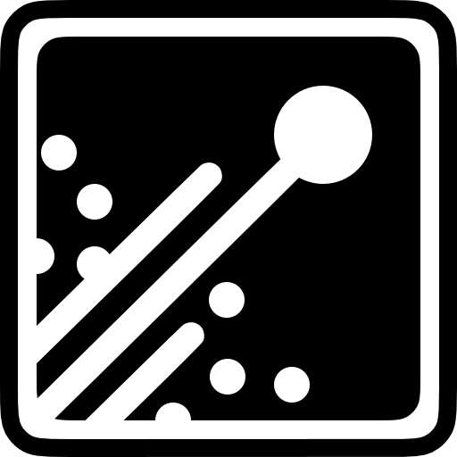

<div class="flex h-full justify-center flex-col items-center gap-2">
  
  <span class="text-4xl font-bold tracking-wider text-center leading-10">Building a Modular <br/>Type Safe GraphQL Client</span>
</div>

<!--
- Hey everyone
- I'm here today to talk about building a modular type safe GraphQL client library
- Thanks to the Meetup organizers for having me as a speaker and to all of you for showing up today
-->


---
title: Hey
---

<div class="flex justify-center flex-col items-center">
  
  <p class="text-2xl">Jason Kuhrt</p>
  <p class="text-xl">Hey 👋</p>
  <p class="text-xl">🇨🇦</p>
</div>

<!--
- First off a bit about me
- My name is Jason, I'm a Montreal-based developer with over 10 years experience
- I studied in design but through open-source gateway drugs like Wordpress, jQuery, Node, GitHub, etc. I found my way into this world of systems building
- I've worked on web apps, cloud services, automation, devops, architecture, libraries, etc.
- Some places I've worked at include Prisma, Dialogue, littleBits and in a few weeks I'm joining The Guild. 
- I also work as an open source maintainer on various libraries
- And for the past five years especially I've worked extensively with TypeScript
- Since leaving Prisma this year I've focused my work on a new GraphQL client library called Graffle which is the basis for this talk today.
-->

---
title: What we're going to cover
---

# What we're going to cover

- An overview and demo of Graffle.
- How some of Graffle's features are achieved.

<!--
- Ok, so let's get started
- I'm going to briefly introduce Graffle
- Then we'll spend most of the time diving into implementation details of various features that have advanced type level logic
- Feel free to ask questions at any time if something isn't clear to you
-->

---
title: What is GraphQL?
---


<style>
  .slidev-layout {
    display: flex;
    flex-direction: column;
  }
  .slidev-code-wrapper {
    overflow: scroll;
  }
</style>

<div class="flex justify-center gap-10 min-h-0">
<div class="_col">

Schema

```graphql
scalar DateTime
scalar DateTimeOffset

type Query {
  user(id: ID!): User
}

type User {
  id: ID!
  name: String!
  actions(
    from: DateTimeOffset,
    to: DateTimeOffset,
    actionType: ActionType
  ): [Action!]!
}

enum ActionType {
  like
  message
}

union Action = ActionLike | ActionMessage

interface ActionBase {
  id: ID!
  createdAt: DateTime!
}

type ActionLike implements ActionBase {
  user: User!
  date: DateTime!
}

type ActionMessage implements ActionBase {
  content: String!
  to: User!
  from: User!
}
```

</div>
<div class="_col">

Request

```graphql
  user(id: "abc123") {
    name
    messagesSince1WeekAgo: actions(
      from: "now-1w",
      actionType: message
    ) {
      __typename
      createdAt
      ... on ActionMessage {
        to {
          id
        }
        content
      }
    }
    likesSince2MonthsAgo: actions(
      from: "now-24h",
      actionType: like
    ) {
      __typename
      createdAt
      ... on ActionLike {
        user {
          id
        }
      }
    }
  }
```

</div>
<div class="_col">

Data

```json
{
  "data": {
    "user": {
      "name": "John Doe",
      "messagesSince1WeekAgo": [
        {
          "__typename": "ActionMessage",
          "createdAt": "2024-01-01T22:55:43Z",
          "to": {
            "id": "def456"
          },
          "content": "Hello, world!"
        }
      ],
      "likesSince2MonthsAgo": [
        {
          "__typename": "ActionLike",
          "createdAt": "2023-12-15T16:12:78Z",
          "user": {
            "id": "ghi789"
          }
        }
      ]
    }
  }
}

```

</div>
</div>
<!--
- So if you're not familiar with GraphQL, this slide is for you
- I won't be going into detail about it today
-->

---
title: What is Graffle?
---

# What is Graffle?

- A TypeScript library
- For sending GraphQL requests
- That runs in browsers, Node, Deno, Bun
- That has multiple transports (http, memory)
- That has multiple interfaces (GraphQL, TypeScript)

---
title: Graffle Demo
---

# Graffle Demo


---
title: Vanilla GraphQL
---

<!--
1. Send requests using GraphQL syntax.
-->


---
title: Document Builder
---

<!--
1. Use CLI to generate types from a schema.
-->

---
title: "Document Builder: Methods"
---


---
title: "Document Builder: Aliases"
---

---
title: "Document Builder: Arguments"
---

---
title: "Document Builder: Directives"
---

---
title: "Document Builder: Enums"
---

---
title: "Document Builder: Inline Fragments"
---

---
title: Custom Scalars
---

---
title: Extensions
---

---
title: "Extensions: Custom Method"
---

---
title: "Extensions: Custom Chaining Method"
---

---
title: "Extensions: Anyware"
---

---
title: "What's Next for Graffle"
---


---
title: "Thanks!"
---
