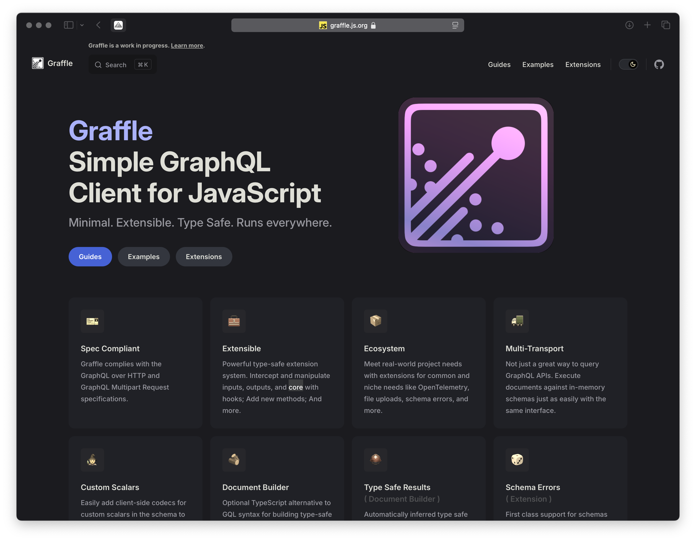

# GRAFFLE


## A Modular Type Safe GraphQL Client for JavaScript.

### Exploring Advanced Type Level Techniques

<span style="font-size: 0.6rem;color:hsla(45, 50%, 80%, 1);">
  Animal Emojis Edition
  <div class="ml-1 inline-flex flex-row gap-2">
    <fxemoji-goat />
    <fxemoji-wolfface />
    <fxemoji-octopus />
    <fxemoji-dragonside />
    <fxemoji-honeybee />
    <fxemoji-spurtingwhale />
  </div>
</span>

<!--
- Hey everyone
- I'm here today to talk about building a modular type safe GraphQL client library
- Thanks to the Meetup organizers for having me as a speaker and to all of you for showing up today
-->

---
layout: statement
title: Hello
hideInToc: true
---

<style>
.local pre.shiki {
  padding: 2rem!important;
  min-width: 400px;
}
.local pre.shiki * {
  font-size: 0.8rem!important;
}
</style>

<div class="local flex flex-row items-center gap-10">
<div>
  
</div>
<div class="text-left" style="font-size:1rem!important;">

```ts
interface Me {
  name: 'Jason Kuhrt'
  based: 'Montreal'
  ex: [
    'Prisma',
    'Dialogue',
    'littleBits',
    ...unknown[]
  ]
  creator: [
    'Paka',
    'Graffle',
    'Molt',
    'Dripip',
    'Nexus',
    'React Popover',
    ...unknown[]
  ]
  nerd: true
  website: 'https://kuhrt.me'
}

```

</div>
</div>

<!--
- First off a bit about me
- My name is Jason, I'm a Montreal-based developer with over 10 years experience
- I studied in design but through open-source gateway drugs like Wordpress, jQuery, Node, GitHub, etc. I found my way into this world of systems building
- I've worked on web apps, cloud services, automation, devops, architecture, libraries, etc.
- Some places I've worked at include Prisma, Dialogue, littleBits and in a few weeks I'm joining The Guild.
- I also work as an open source maintainer on various libraries
- And for the past five years especially I've worked extensively with TypeScript
- Since leaving Prisma this year I've focused my work on a new GraphQL client library called Graffle which is the basis for this talk today.
-->

---
hideInToc: true
---

<style>
.slidev-toc a {
  border-bottom: none!important;
}
</style>

# Plan

45 minutes

<toc></toc>

<!--
- Ok, so let's get started
- I'm going to briefly introduce Graffle
- Then we'll spend most of the time diving into implementation details of various features that have advanced type level logic
- Feel free to ask questions at any time if something isn't clear to you
-->

---
title: What is GraphQL?
---

# What is GraphQL?

<style>
  .slidev-layout {
    display: flex;
    flex-direction: column;
  }
  .slidev-code-wrapper {
    overflow: scroll;
  }
</style>

<div class="flex justify-center gap-10 min-h-0">
<div class="_col">

Schema

```graphql
scalar DateTime
scalar DateTimeOffset

type Query {
  user(id: ID!): User
}

type User {
  id: ID!
  name: String!
  actions(
    from: DateTimeOffset,
    to: DateTimeOffset,
    actionType: ActionType
  ): [Action!]!
}

enum ActionType {
  like
  message
}

union Action = ActionLike | ActionMessage

interface ActionBase {
  id: ID!
  createdAt: DateTime!
}

type ActionLike implements ActionBase {
  user: User!
  date: DateTime!
}

type ActionMessage implements ActionBase {
  content: String!
  to: User!
  from: User!
}
```

</div>
<div class="_col">

Request

```graphql
user(id: "abc123") {
  name
  messagesSince1WeekAgo: actions(
    from: "now-1w",
    actionType: message
  ) {
    __typename
    createdAt
    ... on ActionMessage {
      to {
        id
      }
      content
    }
  }
  likesSince2MonthsAgo: actions(
    from: "now-24h",
    actionType: like
  ) {
    __typename
    createdAt
    ... on ActionLike {
      user {
        id
      }
    }
  }
}
```

</div>
<div class="_col">

Data

```json
{
  "data": {
    "user": {
      "name": "John Doe",
      "messagesSince1WeekAgo": [
        {
          "__typename": "ActionMessage",
          "createdAt": "2024-01-01T22:55:43Z",
          "to": {
            "id": "def456"
          },
          "content": "Hello, world!"
        }
      ],
      "likesSince2MonthsAgo": [
        {
          "__typename": "ActionLike",
          "createdAt": "2023-12-15T16:12:78Z",
          "user": {
            "id": "ghi789"
          }
        }
      ]
    }
  }
}
```

</div>
</div>
<!--
- So if you're not familiar with GraphQL, this slide is for you
- I won't be going into detail about it today
-->

---

# What is Graffle?

- A TypeScript library
- For sending GraphQL requests
- That runs in browsers, Node, Deno, Bun
- That has multiple transports (http, memory)
- That has multiple interfaces (GraphQL, TypeScript)




---
layout: statement
---

# Demo Time

<br>

<a class="emoji-link" href="cursor://file//Users/jasonkuhrt/projects/graffle/tech-talk-2024-11/demos/1-gql.ts"><fxemoji-goat /></a>

---
layout: statement
---

# TS Technique 1: Addressable Global Type Augmentation

<br>

<a class="emoji-link" href="cursor://file//Users/jasonkuhrt/projects/graffle/tech-talk-2024-11/techniques/1-global-augmentation/main.ts"><fxemoji-wolfface /></a>

---
layout: statement
---

# TS Technique 2: Type-Level Functions

<br>

<a class="emoji-link" href="cursor://file//Users/jasonkuhrt/projects/graffle/tech-talk-2024-11/techniques/2-type-level-functions/main.ts"><fxemoji-octopus /></a>

---
layout: statement
---

# TS Technique 3: Recursive Builder

<br>

<a class="emoji-link" href="cursor://file//Users/jasonkuhrt/projects/graffle/tech-talk-2024-11/techniques/3-recursive-builder/main.ts"><fxemoji-dragonside /></a>

---
layout: statement
---

# TS Technique 4: Type Testing

<br>

<a class="emoji-link" href="cursor://file//Users/jasonkuhrt/projects/graffle/tech-talk-2024-11/techniques/4-type-testing/examples.md"><fxemoji-honeybee /></a>

---

# How To Master Advanced TypeScript?

- Write your own **libraries**, practice practice practice.
- ... Write more of your own **libraries**, practice practice practice!
- Ask questions on ... <sup>1</sup> 
  - Stack Overflow, hardest ones _always_ answered by [jcalz](https://stackoverflow.com/users/2887218/jcalz)! 
  - [TypeScript Discord](https://discord.com/invite/typescript).
- Scattered Ad-hoc Articles
  - Andrea Simone Costa https://andreasimonecosta.dev/posts/
  - Sandro Maglione https://sandromaglione.com
- Read source code (especially of libraries you use) e.g. [TypeFest](https://github.com/sindresorhus/type-fest), [Zod](https://github.com/colinhacks/zod), [ArkType](https://github.com/arktypeio/arktype), [Graffle](https://github.com/graffle-js/graffle), [Effect](https://github.com/Effect-TS/effect), ...
- (paid) Some of the [Total TypeScript course](https://www.totaltypescript.com)

--

<sup>1</sup> Share scenarios with [TypeScript Bug Workbench](https://www.typescriptlang.org/dev/bug-workbench/)

---

# What's Next for Graffle

### Financial Support

- Handful of one-time donations (Open Collective)
- Sponsorship by The Guild

### Roadmap

- Modular Transports (in progress)
- GraphQL OneOf Support
- Defer & Stream Support
- Documentation (Website, JSDoc)
- Factor out Anyware library
- ...
- Q1 2025: First stable release!


_And hopefully your feedback on GitHub issues!_ <fxemoji-smallsmile />

---
layout: statement
---

# Thanks! <fxemoji-spurtingwhale class="animate" />


https://github.com/graffle-js/tech-talk-2024-11

https://graffle.js.org

https://bsky.app/profile/kuhrt.me
