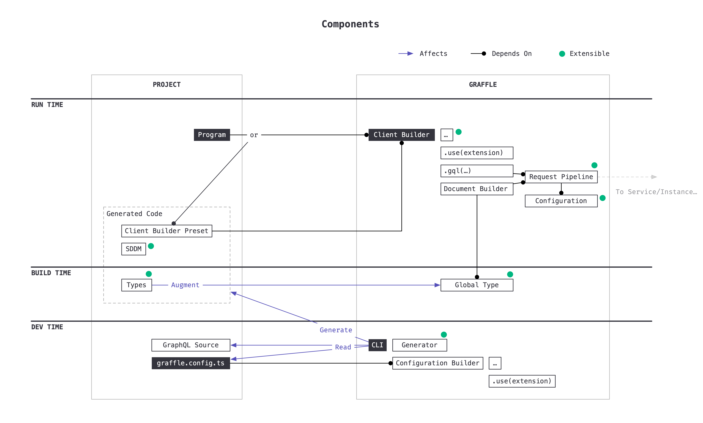

# GRAFFLE


## A Modular Type Safe GraphQL Client for JavaScript.

### Exploring Advanced Type Level Techniques

<span style="font-size: 0.6rem;color:hsla(45, 50%, 80%, 1);">
  Animal Emojis Edition
  <div class="ml-1 inline-flex flex-row gap-2">
    <fxemoji-goat />
    <fxemoji-wolfface />
    <fxemoji-octopus />
    <fxemoji-dragonside />
    <fxemoji-honeybee />
    <fxemoji-spurtingwhale />
  </div>
</span>


---
layout: statement
title: Hello
hideInToc: true
---

<style>
.local pre.shiki {
  padding: 2rem!important;
  min-width: 400px;
}
.local pre.shiki * {
  font-size: 0.8rem!important;
}
</style>

<div class="local flex flex-row items-center gap-10">
<div>
  
</div>
<div class="text-left" style="font-size:1rem!important;">

```ts
interface Me {
  name: 'Jason Kuhrt'
  based: 'Montreal'
  ex: [
    'Prisma',
    'Dialogue',
    'littleBits',
    ...unknown[]
  ]
  creator: [
    'Paka',
    'Graffle',
    'Molt',
    'Dripip',
    'Nexus',
    'React Popover',
    ...unknown[]
  ]
  nerd: true
  website: 'https://kuhrt.me'
}

```

</div>
</div>

---
hideInToc: true
---

<style>
.slidev-toc li {
  line-height: 0.5!important;
  margin-left: 0;
  list-style-type: circle;
  font-size: 0.8rem;
}
.slidev-toc a {
  border-bottom: none!important;
}
</style>

# Plan

45 minutes

<toc></toc>

---
title: What is GraphQL?
---

# What is GraphQL?

<style>
  .slidev-layout {
    height: 100%;
    display: flex;
    flex-direction: column;
  }
  .slidev-code-wrapper {
    overflow: scroll;
  }
</style>

<div class="flex justify-center gap-10 min-h-0">
<div class="_col">

Schema

```graphql
scalar DateTime
scalar DateTimeOffset

type Query {
  user(id: ID!): User
}

type User {
  id: ID!
  name: String!
  actions(
    from: DateTimeOffset,
    to: DateTimeOffset,
    actionType: ActionType
  ): [Action!]!
}

enum ActionType {
  like
  message
}

union Action = ActionLike | ActionMessage

interface ActionBase {
  id: ID!
  createdAt: DateTime!
}

type ActionLike implements ActionBase {
  user: User!
  date: DateTime!
}

type ActionMessage implements ActionBase {
  content: String!
  to: User!
  from: User!
}
```

</div>
<div class="_col">

Request

```graphql
user(id: "abc123") {
  name
  messagesSince1WeekAgo: actions(
    from: "now-1w",
    actionType: message
  ) {
    __typename
    createdAt
    ... on ActionMessage {
      to {
        id
      }
      content
    }
  }
  likesSince2MonthsAgo: actions(
    from: "now-24h",
    actionType: like
  ) {
    __typename
    createdAt
    ... on ActionLike {
      user {
        id
      }
    }
  }
}
```

</div>
<div class="_col">

Data

```json
{
  "data": {
    "user": {
      "name": "John Doe",
      "messagesSince1WeekAgo": [
        {
          "__typename": "ActionMessage",
          "createdAt": "2024-01-01T22:55:43Z",
          "to": {
            "id": "def456"
          },
          "content": "Hello, world!"
        }
      ],
      "likesSince2MonthsAgo": [
        {
          "__typename": "ActionLike",
          "createdAt": "2023-12-15T16:12:78Z",
          "user": {
            "id": "ghi789"
          }
        }
      ]
    }
  }
}
```

</div>
</div>
<!--
- So if you're not familiar with GraphQL, this slide is for you
- I won't be going into detail about it today
-->

---

# What is Graffle?

- A TypeScript library
- For sending GraphQL requests
- That (should) runs in browsers, Node, Deno, Bun
- That has multiple transports (http, memory)
- That has multiple interfaces (GraphQL, TypeScript)
- That is modular


---
layout: image
title: Components Overview
# image: /assets/components.png
---

<style>
#slide-container:has(.slidev-page-6:not([style*="display: none"])) {
  background: black!important;
}
#slideshow:has(.slidev-page-6:not([style*="display: none"])) {
	background: black!important;

  .slidev-layout {
    padding: 0!important;
    margin: 0!important;
  }
}

</style>




---
layout: statement
---

# Demo Time

<br>

<a class="emoji-link" href="cursor://file//Users/jasonkuhrt/projects/graffle/tech-talk-2024-11/demos/1-gql.ts"><fxemoji-goat /></a>

---
layout: two-cols-header
---

# Is it <strike>done</strike> production ready?

- No (but maybe good enough for you?)
- Continuous pre-releases: `pnpm add graffle@next`
- 500+ tests: unit (type & value level) + E2E
- Bug fixes prioritized (closed in single digit days)

::left::

## Stable (ish)

- Raw interface
- Document builder interface
- Request pipeline
- Custom Scalars


::right::

## Unstable (ish)

- Extension System
- Extensions
- Output configuration
- CLI


---

<style>
.local .slidev-code {
  font-size: 1.8rem;
}
</style>
<div class="local">

# What's Next?

### Sustainability

- Handful of one-time donations (Open Collective)
- Sponsorship by The Guild
- Decreased hours starting December: 15-20 hours/wk

### Features Etc.

```
Currently:
* feat(extension-system) : Extensible transports
* improve(perf)          : Reduce bundle size (e.g. web preset, http transport, no memory)

Soon:
* chore(docs)            : Better documentation (Website, JSDoc)
* refactor               : Extract anyware package
* feat(request)          : OneOf, @defer, @stream, subscription
* improve(types)         : Simplify _appearance of_ public interface types
* feat(extension/*)      : More: Effect, Cache, BatchRequest ...
* feat                   : Automated Clients: @graffle/client-github | shopify | cloudflare-queues | yelp
* feat(extension-system) : Extensible directives
```

</div>
---
layout: statement
---

# Can I help?

## Yes!

Bug reports

Experience reports

Feature requests

Pull requests

---
layout: statement
---

# TS Techniques

<div class="inline-flex flex-row gap-4">
<fxemoji-goat />
<fxemoji-wolfface />
<fxemoji-octopus />
<fxemoji-dragonside />
<fxemoji-honeybee />
<fxemoji-spurtingwhale />
</div>

---
layout: statement
---

# TS Technique 1: Addressable Global Type Augmentation

<br>

<a class="emoji-link" href="cursor://file//Users/jasonkuhrt/projects/graffle/tech-talk-2024-11/techniques/1-global-augmentation/main.ts"><fxemoji-wolfface /></a>

---
layout: statement
---

# TS Technique 2: Type-Level Functions

<br>

<a class="emoji-link" href="cursor://file//Users/jasonkuhrt/projects/graffle/tech-talk-2024-11/techniques/2-type-level-functions/main.ts"><fxemoji-octopus /></a>

---
layout: statement
---

# TS Technique 3: Recursive Builder

<br>

<a class="emoji-link" href="cursor://file//Users/jasonkuhrt/projects/graffle/tech-talk-2024-11/techniques/3-recursive-builder/main.ts"><fxemoji-dragonside /></a>

---
layout: statement
---

# TS Technique 4: Type Testing

<br>

<a class="emoji-link" href="cursor://file//Users/jasonkuhrt/projects/graffle/tech-talk-2024-11/techniques/4-type-testing/examples.md"><fxemoji-honeybee /></a>

---

# Ways You Might Improve Your TypeScript Skills

- Write library code
- Ask questions on ... (leverage [TypeScript Bug Workbench](https://www.typescriptlang.org/dev/bug-workbench/))
  - Stack Overflow, often answered by [jcalz](https://stackoverflow.com/users/2887218/jcalz) 
  - [TypeScript Discord](https://discord.com/invite/typescript).
  - [ArkType Discord](https://discord.com/invite/xEzdc3fJQC) ([David Blass](https://github.com/ssalbdivad)).
  - [Effect Discord](https://discord.com/invite/effect-ts).
- Read some articles (scattered, ad-hoc)
  - Andrea Simone Costa https://andreasimonecosta.dev/posts/
  - Sandro Maglione https://sandromaglione.com
- Read source code of libraries you use e.g. [TypeFest](https://github.com/sindresorhus/type-fest), [Zod](https://github.com/colinhacks/zod), [ArkType](https://github.com/arktypeio/arktype), [Graffle](https://github.com/graffle-js/graffle), [Effect](https://github.com/Effect-TS/effect), ...


---
layout: statement
---

# Thanks! <fxemoji-spurtingwhale class="animate" />


https://github.com/graffle-js/tech-talk-2024-11

https://graffle.js.org

https://bsky.app/profile/kuhrt.me
